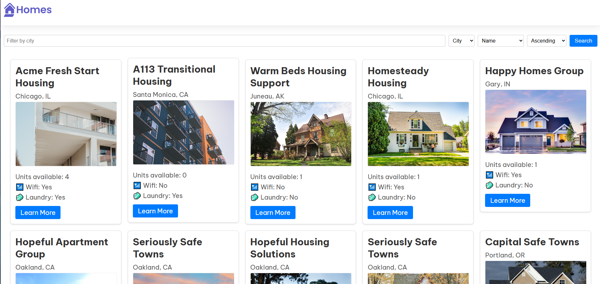
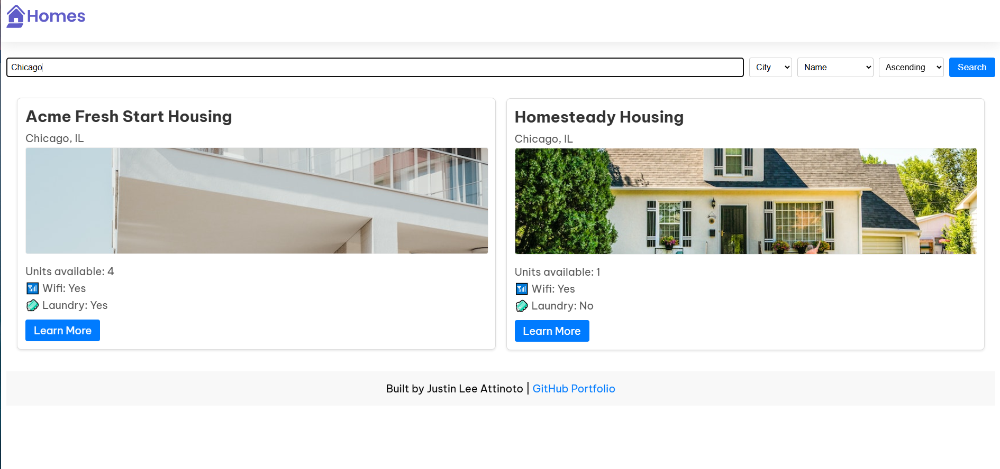
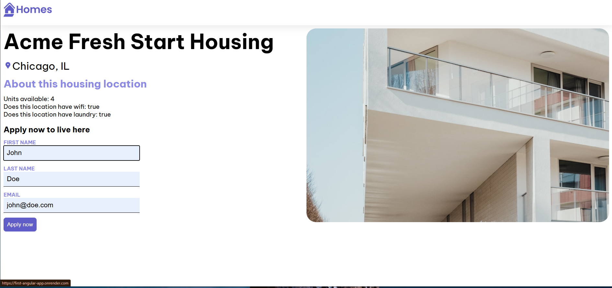

Angular Housing App
Overview
This is my first Angular application, a single-page application (SPA) for browsing housing locations. Built with Angular 19, TypeScript, and a JSON server backend, it features a responsive UI, multi-filter search, sorting, and a user-friendly application form. Deployed on Render.com, this project showcases my skills in frontend development, API integration, and deployment.
Features

Multi-Filter Search: Filter housing locations by city, name, or state with real-time input updates.
Sorting Options: Sort results by name or available units in ascending or descending order.
Details View: View detailed information for each location, including photo, city, state, available units, Wi-Fi, laundry, and a location pin.
Application Form: Submit applications with first name, last name, and email, logged to the console.
Responsive Design: Grid-based layout adapts to various screen sizes, with hover effects and optimized image loading (eager for LCP).
Error Handling: Robust fetch error handling ensures the app remains stable if the backend fails.
Navigation: Seamless routing with a clickable logo and deep links to details pages.
Portfolio Integration: Footer links to my GitHub repositories (https://github.com/justin-Attinoto-Coder?tab=repositories).

Tech Stack

Frontend: Angular 19, TypeScript, HTML, CSS
Backend: JSON Server (json-server@0.17.4) serving db.json
Deployment: Render.com (static site for frontend, web service for backend)
Version Control: Git, GitHub

Live Demo

Frontend: https://first-angular-app.onrender.com
Backend: https://first-angular-app-backend.onrender.com/locations

Installation

Clone the repository:git clone https://github.com/justin-Attinoto-Coder/first-angular-app.git
cd first-angular-app

Install dependencies:npm install

Start the backend:set PORT=3000
npm run start:server

Start the frontend:npm start

Open http://localhost:4200 in your browser.

Screenshots
(Add screenshots here, e.g., home page with search, details page, form submission. Use tools like Snipping Tool or browser dev tools to capture.)
Future Enhancements

Add unit tests with Jasmine/Karma.
Implement a real backend with Node.js and MongoDB.
Enhance UI with animations and advanced styling.

## Screenshots

Contact

GitHub: justin-Attinoto-Coder
LinkedIn: Justin Attinoto

